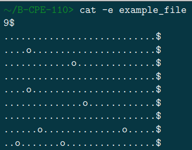
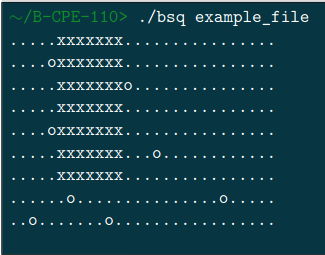
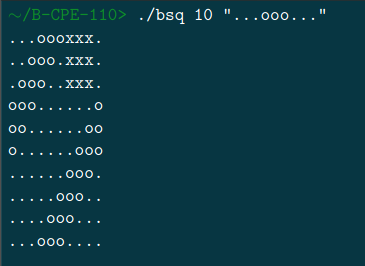

# BSQ

The goal of this project is to find the largest possible square on a board while avoiding obstacles.
The board can be generated two ways :
- The first one is by reading a file passed as the program’s argument.
- The second way to obtain a board is to generate one based on given parameters. The parameters will be a number, representing the width and height of the board, and a pattern that will be repeated line by line along the board
## Examples

Not solved map :  

Solved map :  

It’s definitely a square, even if visually it doesn’t look like one.

## Usage

Compilation :  
    
    make  
Usage for a given map :  
    
    ./bsq [PATH TO THE MAP]

Usage for a generated map :
    
    ./bsq [SIZE] [PATTERN]

Example to generate a map :

## Additional informations

If you want to test the algorithm complexity with different maps there is a folder at the root with a non-exhaustive list of solved and unsolved maps (from 100x100 to 10000x10000)
    
    ./maps-intermediate/mouli_maps/
    
If ever there are several solutions, you have to represent only the highest square. If they
are still several solutions, choose the square to the left.  

The goal of this project was to optimize as much as possible our handmade algorithm to resolve this problem in C.  

Authorized functions :
- open  
- read
- write
- close
- malloc
- free
- stat
